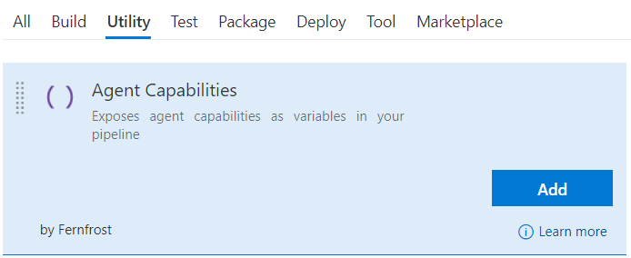
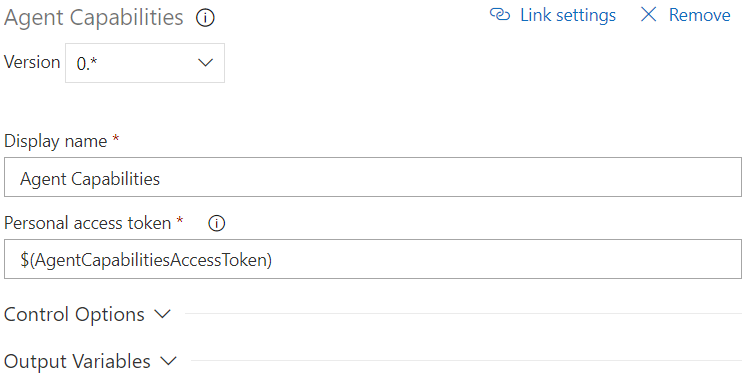
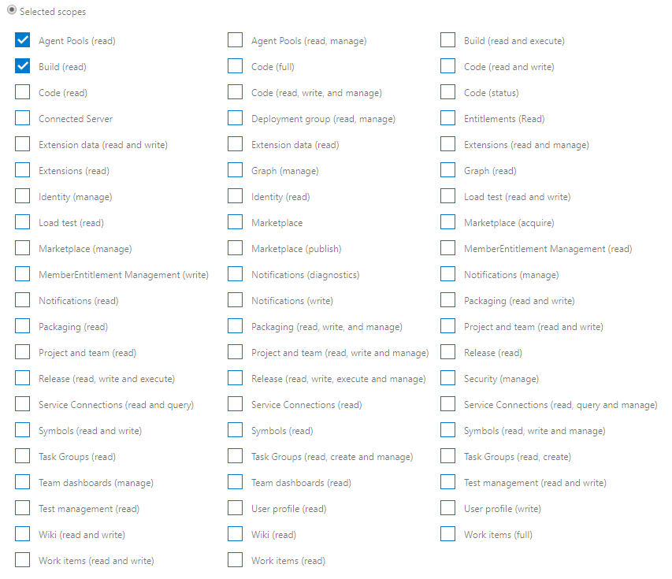

# Agent Capabilities
Exposes agent capabilities as variables in your pipeline. Use them just like any other variable in subsequent tasks.

## Usage
Add a new **Agent Capabilities** task from the **Utility** category...

...and configure it as needed.

Parameters include:
* **Personal access token**: For security, we recommend creating a secret variable for your personal access token, eg. <code>$(AgentCapabilitiesAccessToken)</code> and referense it here. Required scopes are <code>"Agent Pools (read)"</code> and <code>"Build (read)"</code>.
[Learn how to create a personal access token](https://docs.microsoft.com/en-us/vsts/organizations/accounts/use-personal-access-tokens-to-authenticate?view=vsts).

## Having Problems?
Please [create an issue on our Github](https://github.com/Fernfrost/vsts-task-agent-capabilities/issues) and we will try to help you.